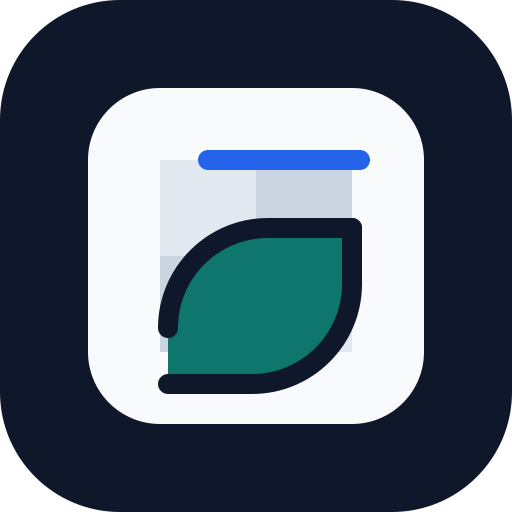
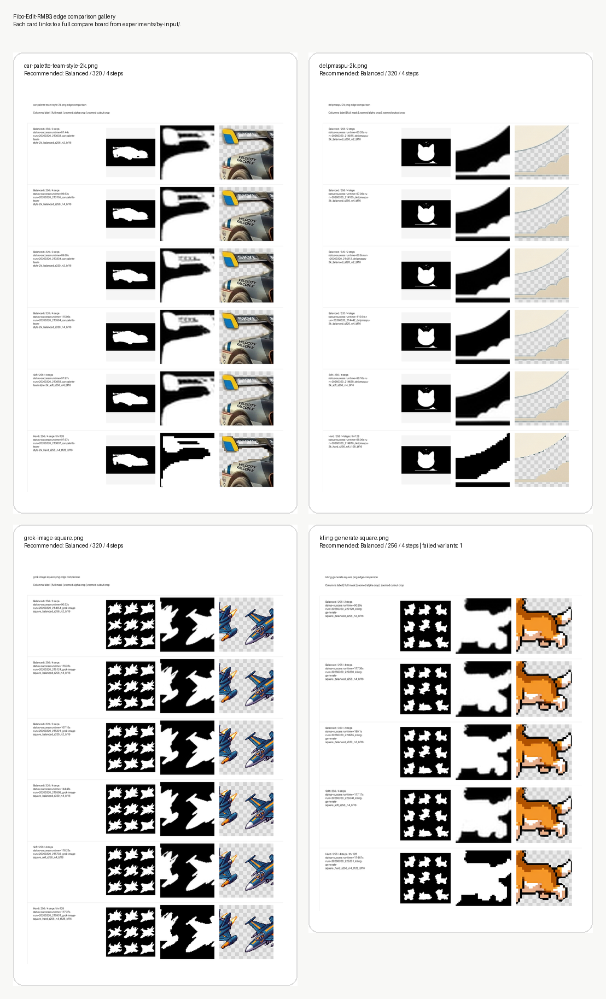
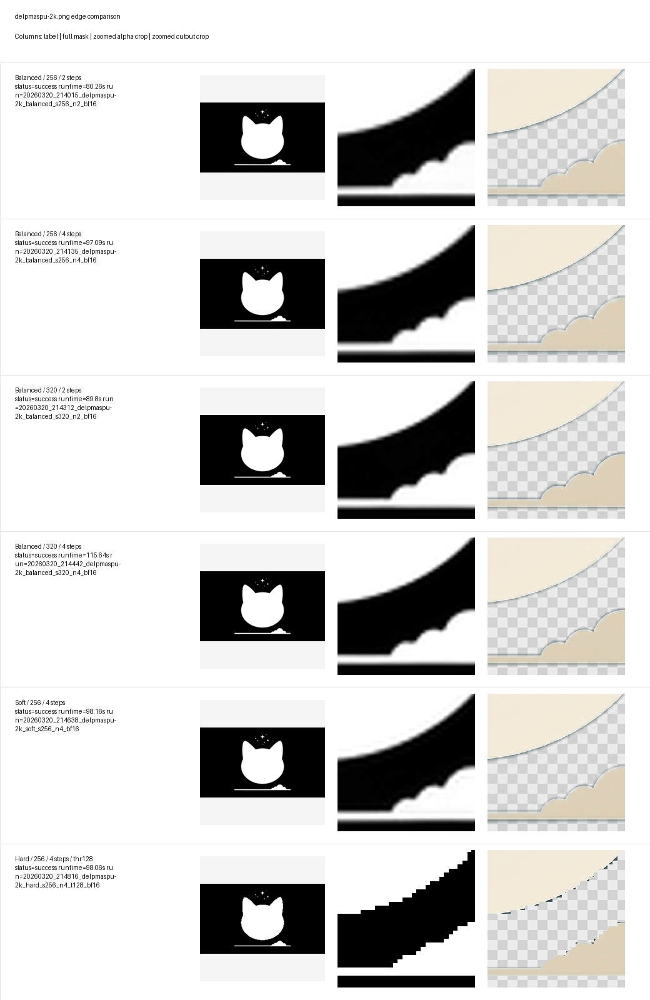
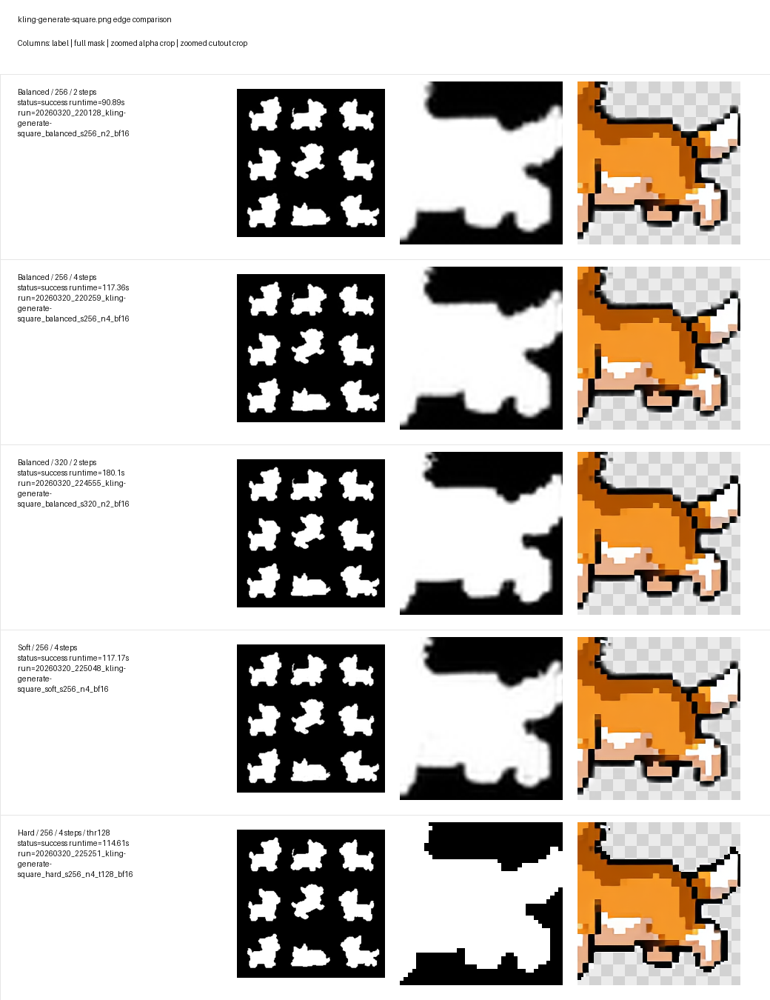

<p align="center">
  
</p>

<h1 align="center">Fibo-Edit-RMBG Sandbox</h1>

<p align="center">
  gated な
  <a href="https://huggingface.co/briaai/Fibo-Edit-RMBG">BRIA Fibo-Edit-RMBG</a>
  をローカルで検証するための、UV ベースのラッパー CLI / 実験ワークスペースです。
</p>

<p align="center">
  <a href="./README.md"><strong>English</strong></a>
  |
  <a href="./README.ja.md"><strong>日本語</strong></a>
</p>

<p align="center">
  <a href="https://github.com/Sunwood-ai-labs/Fibo-Edit-RMBG-sandbox/actions/workflows/ci.yml"></a>
  <a href="https://github.com/Sunwood-ai-labs/Fibo-Edit-RMBG-sandbox/actions/workflows/docs.yml"></a>
  
  
  
</p>

## ✨ 概要

このリポジトリでは `briaai/Fibo-Edit-RMBG` を扱うための最小限の実用環境をまとめています。

- `uv` で Python 環境を構築
- ローカル画像に対して背景除去 CLI を実行
- `soft` / `balanced` / `hard` の境界差を比較
- 実験結果と compare board をリポジトリ内に保存

ここに含まれるのはラッパーコード、ドキュメント、実験成果物です。
上流モデルの重みは同梱していません。利用には Hugging Face 側でのアクセス承認と、
BRIA の `bria-fibo-edit` 条件への同意が必要です。

主要リンク:

- [Docs サイト](https://sunwood-ai-labs.github.io/Fibo-Edit-RMBG-sandbox/)
- [実験ギャラリー](./experiments/README.md)

## 🚀 クイックスタート

1. 上流モデルへのアクセスを申請する:
   [briaai/Fibo-Edit-RMBG](https://huggingface.co/briaai/Fibo-Edit-RMBG)
2. `.env.example` を `.env` にコピーする
3. `HF_TOKEN` を設定する
4. `uv` で依存関係を入れる

```powershell
uv sync --python 3.11 --index https://download.pytorch.org/whl/cu128
```

検証済みの Windows + RTX 3060 6GB 環境で最速だったベースライン:

```powershell
uv run fibo-rmbg `
  --input .\example\grok-image-square.png `
  --output .\outputs\grok-image-square.rmbg.png `
  --mask-output .\outputs\grok-image-square.mask.png `
  --max-side 256 `
  --num-inference-steps 1 `
  --dtype bfloat16
```

ギザギザを抑えたいときの最初の候補:

```powershell
uv run fibo-rmbg `
  --input .\example\grok-image-square.png `
  --output .\outputs\grok-image-square.balanced.rmbg.png `
  --mask-output .\outputs\grok-image-square.balanced.mask.png `
  --max-side 256 `
  --num-inference-steps 4 `
  --dtype bfloat16 `
  --mask-style balanced
```

## 🧪 境界比較実験

このリポジトリには `example/` の入力に対する境界比較実験が保存されています。

- 検証済みの Windows + RTX 3060 6GB 環境では `balanced` が最も無難な既定候補です
- 3 枚では `balanced / 320 / 4 steps` が最良候補でした
- `kling-generate-square.png` は `balanced / 256 / 4 steps` が現実解です
- `hard` は既定値ではなく、階段状ノイズ比較用の参照設定です

実験一式:

```powershell
uv run python .\scripts\run_edge_experiments.py
```

未完了分だけ再開:

```powershell
uv run python .\scripts\run_edge_experiments.py --resume
```

推論を回さずに比較画像と集計だけ更新:

```powershell
uv run python .\scripts\run_edge_experiments.py --postprocess-only
```



参照先:

- [Experiment overview](./experiments/README.md)
- [Per-input compare boards](./experiments/by-input/)
- [Canonical CSV summary](./experiments/summary.csv)

### 入力ごとの比較ボード

#### `car-palette-team-style-2k.png`

車体の長いスポイラー曲線、細いパーツ、ロゴまわりを含むケースです。曲線の境界が階段状にならないかを確認するのにいちばん分かりやすい比較です。

最初は `balanced / 320 / 4 steps` から見るのが安全です。


#### `delpmaspu-2k.png`

単純なイラスト調の丸い輪郭と、なだらかな背景カーブを含むケースです。ハローの出方と、自然なアンチエイリアスの付き方を見比べるのに向いています。

最初は `balanced / 320 / 4 steps` を確認してください。



#### `grok-image-square.png`

斜めのフィンや尖った角を多く含む、戦闘機風のシルエットです。先端のシャープさを残しつつ、`hard` のようなブロック感を避けられているかが見どころです。

最初は `balanced / 320 / 4 steps` を見るのがおすすめです。


#### `kling-generate-square.png`

意図的にドット感のある犬のピクセルアートです。スタイルとしてのカクつきを残しつつ、不自然なハードマスク化を避けられるかを見るためのケースです。

この入力だけは `320 / 4 steps` がこのマシンで失敗したため、`balanced / 256 / 4 steps` を先に見るのが現実解です。



## ⚙️ CLI メモ

主なオプション:

- `--mask-style soft|balanced|hard`
- `--num-inference-steps`
- `--max-side`
- `--alpha-threshold`
- `--cpu-offload` は実験用途

ローカル実行記録から見えた傾向:

- `balanced` は `hard` より滑らかで、`soft` ほどハローが増えにくい
- `hard` は曲線で階段状ノイズが出やすい
- `soft` はギザギザを隠せる代わりに輪郭が太りやすい
- `--cpu-offload` はこの Windows 環境では VAE 系の問題で安定しませんでした

詳細:

- [Documentation site](https://sunwood-ai-labs.github.io/Fibo-Edit-RMBG-sandbox/)
- [はじめに](./docs/ja/guide/getting-started.md)
- [CLI ガイド](./docs/ja/guide/cli.md)
- [実験記録](./docs/ja/guide/experiments.md)
- [トラブルシューティング](./docs/ja/guide/troubleshooting.md)

## 📁 リポジトリ構成

```text
example/                      入力画像
experiments/                  実験集計と compare board
fibo_edit_rmbg_sandbox/       Python パッケージと CLI
outputs/                      出力 PNG サンプル
scripts/run_edge_experiments.py
docs/                         VitePress ドキュメント
```

## 🩺 トラブルシューティング

- 推論前に読み込みが失敗する場合は、Hugging Face 側のアクセス承認と `HF_TOKEN` を確認してください
- Windows で `os error 1455` や `MemoryError` が出たら、`--max-side` か `--num-inference-steps` を下げてください
- 輪郭が硬すぎる場合は `hard` ではなく `balanced` に戻してください
- 輪郭がぼやける場合は、まず `balanced` のまま `--num-inference-steps` を増やしてください

既知の失敗パターンはガイドにまとめています:
[docs/ja/guide/troubleshooting.md](./docs/ja/guide/troubleshooting.md)

## 📄 ライセンス

- このリポジトリのコードと docs: [MIT](./LICENSE)
- 上流モデルの重みと利用条件: Hugging Face 上の BRIA `bria-fibo-edit`

このリポジトリのライセンスは、あくまでラッパーコード側に対して適用されます。
