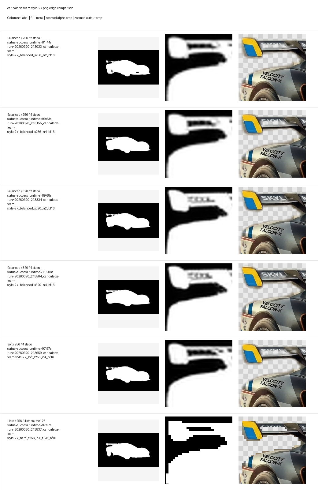

# car-palette-team-style-2k.png

| Variant | Status | Runtime (s) | Run | Notes |
| --- | --- | ---: | --- | --- |
| Balanced / 256 / 2 steps | success | 81.44 | [20260320_213033_car-palette-team-style-2k_balanced_s256_n2_bf16](../runs/20260320_213033_car-palette-team-style-2k_balanced_s256_n2_bf16/README.md) | Safe anti-jaggy baseline. |
| Balanced / 320 / 2 steps | success | 89.68 | [20260320_213334_car-palette-team-style-2k_balanced_s320_n2_bf16](../runs/20260320_213334_car-palette-team-style-2k_balanced_s320_n2_bf16/README.md) | Higher mask resolution at a moderate runtime cost. |
| Soft / 256 / 4 steps | success | 97.97 | [20260320_213659_car-palette-team-style-2k_soft_s256_n4_bf16](../runs/20260320_213659_car-palette-team-style-2k_soft_s256_n4_bf16/README.md) | Smoothest edge reference; watch for halos. |
| Hard / 256 / 4 steps / thr128 | success | 97.97 | [20260320_213837_car-palette-team-style-2k_hard_s256_n4_t128_bf16](../runs/20260320_213837_car-palette-team-style-2k_hard_s256_n4_t128_bf16/README.md) | Crisp reference; likely to show staircase artifacts. |
| Balanced / 256 / 4 steps | success | 99.63 | [20260320_213155_car-palette-team-style-2k_balanced_s256_n4_bf16](../runs/20260320_213155_car-palette-team-style-2k_balanced_s256_n4_bf16/README.md) | Primary quality candidate on this 6GB GPU. |
| Balanced / 320 / 4 steps | success | 115.06 | [20260320_213504_car-palette-team-style-2k_balanced_s320_n4_bf16](../runs/20260320_213504_car-palette-team-style-2k_balanced_s320_n4_bf16/README.md) | Stretch target for better edges if VRAM holds. |

Recommended first check: `Balanced / 320 / 4 steps`
