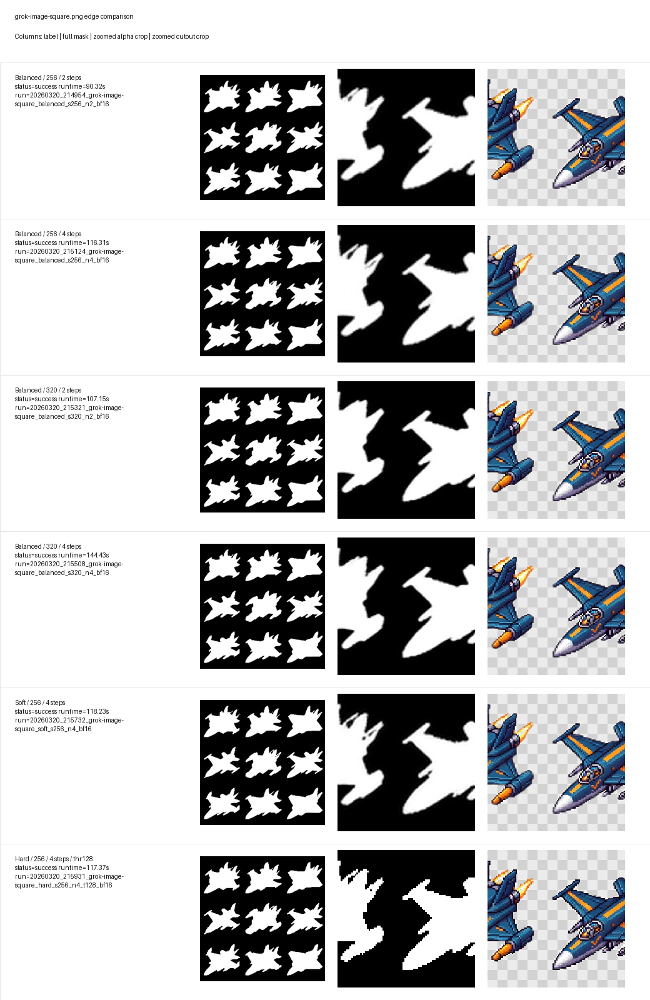

# grok-image-square.png

Published pages keep the representative run ID for traceability. Raw `experiments/runs/` folders stay local-only and are ignored by Git.

| Variant | Status | Runtime (s) | Run ID | Notes |
| --- | --- | ---: | --- | --- |
| Balanced / 256 / 2 steps | success | 90.32 | `20260320_214954_grok-image-square_balanced_s256_n2_bf16` | Safe anti-jaggy baseline. |
| Balanced / 320 / 2 steps | success | 107.15 | `20260320_215321_grok-image-square_balanced_s320_n2_bf16` | Higher mask resolution at a moderate runtime cost. |
| Balanced / 256 / 4 steps | success | 116.31 | `20260320_215124_grok-image-square_balanced_s256_n4_bf16` | Primary quality candidate on this 6GB GPU. |
| Hard / 256 / 4 steps / thr128 | success | 117.37 | `20260320_215931_grok-image-square_hard_s256_n4_t128_bf16` | Crisp reference; likely to show staircase artifacts. |
| Soft / 256 / 4 steps | success | 118.23 | `20260320_215732_grok-image-square_soft_s256_n4_bf16` | Smoothest edge reference; watch for halos. |
| Balanced / 320 / 4 steps | success | 144.43 | `20260320_215508_grok-image-square_balanced_s320_n4_bf16` | Stretch target for better edges if VRAM holds. |

Recommended first check: `Balanced / 320 / 4 steps`
